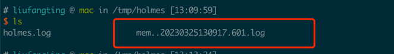

elasticsearch:8.6.2学习笔记

## 1、拉取es镜像

```
docker pull docker.elastic.co/elasticsearch/elasticsearch:8.6.2

docker network create elastic

```

## 2、通过镜像创建es容器

```
docker run -d \
      --name elasticsearch \
      --net elastic \
      -p 9200:9200 \
      -e discovery.type=single-node \
      -e ES_JAVA_OPTS="-Xms1g -Xmx1g"\
      -e xpack.security.enabled=false \
      -it \
      docker.elastic.co/elasticsearch/elasticsearch:8.6.2
```

## 3、部署可视化界面-kibana

```
docker run -d \
    --name kibana \
    --net elastic \
    -p 5601:5601 \
    docker.elastic.co/kibana/kibana:8.6.2
```
访问kibana
http://127.0.0.1:5601/app/dev_tools#/console

## 创建索引

```
put http://localhost:9200/shopping

{
    "acknowledged": true,
    "shards_acknowledged": true,
    "index": "shopping"
}

```
## 查看单个索引
```
get http://localhost:9200/shopping


{
    "shopping": {
        "aliases": {},
        "mappings": {},
        "settings": {
            "index": {
                "creation_date": "1679291036259",
                "number_of_shards": "1",
                "number_of_replicas": "1",
                "uuid": "F8enERP-R4alqBH9olMjIg",
                "version": {
                    "created": "7080099"
                },
                "provided_name": "shopping"
            }
        }
    }
}
```


## 查看所有索引
```
get http://localhost:9200/_cat/indices?v

health status index    uuid                   pri rep docs.count docs.deleted store.size pri.store.size
yellow open   shopping F8enERP-R4alqBH9olMjIg   1   1          0            0       208b           208b

```

## 删除索引
```

delete http://localhost:9200/shopping

{
    "acknowledged": true
}
```

## 创建文档
```

post http://localhost:9200/shopping/_doc
{

  "title":"小米手机",
  "category":"小米",
   "images":"http://gulixueyuan.com/a.jpg",
   "price":3999.00

}
{
    "_index": "shopping",
    "_type": "_doc",
    "_id": "UdSl_YYBnwYXvAQ_GAZf",
    "_version": 1,
    "result": "created",
    "_shards": {
        "total": 2,
        "successful": 1,
        "failed": 0
    },
    "_seq_no": 0,
    "_primary_term": 1
}

```
## 查看文档

```
get http://localhost:9200/shopping/_doc/UdSl_YYBnwYXvAQ_GAZf

{
    "_index": "shopping",
    "_type": "_doc",
    "_id": "UdSl_YYBnwYXvAQ_GAZf",
    "_version": 1,
    "_seq_no": 0,
    "_primary_term": 1,
    "found": true,
    "_source": {
        "title": "小米手机",
        "category": "小米",
        "images": "http://gulixueyuan.com/a.jpg",
        "price": 3999.00
    }
}

```

## 查看所有文档
```
get http://localhost:9200/shopping/_search

{
    "took": 58,
    "timed_out": false,
    "_shards": {
        "total": 1,
        "successful": 1,
        "skipped": 0,
        "failed": 0
    },
    "hits": {
        "total": {
            "value": 3,
            "relation": "eq"
        },
        "max_score": 1.0,
        "hits": [
            {
                "_index": "shopping",
                "_type": "_doc",
                "_id": "UdSl_YYBnwYXvAQ_GAZf",
                "_score": 1.0,
                "_source": {
                    "title": "小米手机",
                    "category": "小米",
                    "images": "http://gulixueyuan.com/a.jpg",
                    "price": 3999.00
                }
            },
            {
                "_index": "shopping",
                "_type": "_doc",
                "_id": "UtSn_YYBnwYXvAQ_eQYu",
                "_score": 1.0,
                "_source": {
                    "title": "小米手机",
                    "category": "小米",
                    "images": "http://gulixueyuan.com/a.jpg",
                    "price": 3999.00
                }
            },
            {
                "_index": "shopping",
                "_type": "_doc",
                "_id": "U9Sn_YYBnwYXvAQ_ywZq",
                "_score": 1.0,
                "_source": {
                    "title": "小米手机",
                    "category": "小米",
                    "images": "http://gulixueyuan.com/a.jpg",
                    "price": 3999.00
                }
            }
        ]
    }
}
```

## 文档更新-全量更新
```
put http://localhost:9200/shopping/_doc/U9Sn_YYBnwYXvAQ_ywZq


{
    "_index": "shopping",
    "_type": "_doc",
    "_id": "U9Sn_YYBnwYXvAQ_ywZq",
    "_version": 2,
    "result": "updated",
    "_shards": {
        "total": 2,
        "successful": 1,
        "failed": 0
    },
    "_seq_no": 3,
    "_primary_term": 1
}
```

## 文档更新-局部更新
```
post http://localhost:9200/shopping/_update/U9Sn_YYBnwYXvAQ_ywZq

{

  "doc":{
      "title":"华为手机"
  }

}


查询结果：
{
    "_index": "shopping",
    "_type": "_doc",
    "_id": "U9Sn_YYBnwYXvAQ_ywZq",
    "_version": 6,
    "result": "updated",
    "_shards": {
        "total": 2,
        "successful": 1,
        "failed": 0
    },
    "_seq_no": 7,
    "_primary_term": 1
}


```


## 查看数据
```
get http://localhost:9200/shopping/_search?q=category:小米

{
    "took": 249,
    "timed_out": false,
    "_shards": {
        "total": 1,
        "successful": 1,
        "skipped": 0,
        "failed": 0
    },
    "hits": {
        "total": {
            "value": 3,
            "relation": "eq"
        },
        "max_score": 0.11431682,
        "hits": [
            {
                "_index": "shopping",
                "_type": "_doc",
                "_id": "UdSl_YYBnwYXvAQ_GAZf",
                "_score": 0.11431682,
                "_source": {
                    "title": "小米手机",
                    "category": "小米",
                    "images": "http://gulixueyuan.com/a.jpg",
                    "price": 3999.00
                }
            },
            {
                "_index": "shopping",
                "_type": "_doc",
                "_id": "UtSn_YYBnwYXvAQ_eQYu",
                "_score": 0.11431682,
                "_source": {
                    "title": "小米手机",
                    "category": "小米",
                    "images": "http://gulixueyuan.com/a.jpg",
                    "price": 3999.00
                }
            },
            {
                "_index": "shopping",
                "_type": "_doc",
                "_id": "U9Sn_YYBnwYXvAQ_ywZq",
                "_score": 0.11431682,
                "_source": {
                    "title": "华为手机",
                    "category": "小米",
                    "images": "http://gulixueyuan.com/a.jpg",
                    "price": 1999.0
                }
            }
        ]
    }
}


```

## 分页查询
```

get http://localhost:9200/shopping/_search

{
 "query":{
    "match_all":{}
 },
 "from":0,
 "size":1,
 "sort":{
     "price":{
         "order":"desc"
     }
 }

}

查询结果:

{
    "took": 3,
    "timed_out": false,
    "_shards": {
        "total": 1,
        "successful": 1,
        "skipped": 0,
        "failed": 0
    },
    "hits": {
        "total": {
            "value": 3,
            "relation": "eq"
        },
        "max_score": 1.0,
        "hits": [
            {
                "_index": "shopping",
                "_type": "_doc",
                "_id": "UdSl_YYBnwYXvAQ_GAZf",
                "_score": 1.0,
                "_source": {
                    "title": "小米手机",
                    "category": "小米",
                    "images": "http://gulixueyuan.com/a.jpg",
                    "price": 3999.00
                }
            }
        ]
    }
}
```

## and 查询
```
get http://localhost:9200/shopping/_search

参数:

{
    "query":{
        "bool":{
            "must":[
                {
                    "match":{
                        "category":"小米"
                    }
                }
            ]
        }
    }
}

备注:
   query（查询）-》bool(条件)-》must（多个条件必须同时成立-类似and查询）
   
   
结果：   
   
   {
    "took": 23,
    "timed_out": false,
    "_shards": {
        "total": 1,
        "successful": 1,
        "skipped": 0,
        "failed": 0
    },
    "hits": {
        "total": {
            "value": 3,
            "relation": "eq"
        },
        "max_score": 0.17402273,
        "hits": [
            {
                "_index": "shopping",
                "_type": "_doc",
                "_id": "UdSl_YYBnwYXvAQ_GAZf",
                "_score": 0.17402273,
                "_source": {
                    "title": "小米手机",
                    "category": "小米",
                    "images": "http://gulixueyuan.com/a.jpg",
                    "price": 3999.00
                }
            },
            {
                "_index": "shopping",
                "_type": "_doc",
                "_id": "UtSn_YYBnwYXvAQ_eQYu",
                "_score": 0.17402273,
                "_source": {
                    "title": "小米手机",
                    "category": "小米",
                    "images": "http://gulixueyuan.com/a.jpg",
                    "price": 3999.00
                }
            },
            {
                "_index": "shopping",
                "_type": "_doc",
                "_id": "U9Sn_YYBnwYXvAQ_ywZq",
                "_score": 0.17402273,
                "_source": {
                    "title": "华为手机",
                    "category": "小米",
                    "images": "http://gulixueyuan.com/a.jpg",
                    "price": 1999.0
                }
            }
        ]
    }
}

参数：
{
    "query":{
        "bool":{
            "must":[
                {
                    "match":{
                        "category":"小米"
                    }
                },
                {
                    "match":{
                        "price":1999.0
                    }
                }
            ]
        }
    }
}

结果：
{
    "took": 7,
    "timed_out": false,
    "_shards": {
        "total": 1,
        "successful": 1,
        "skipped": 0,
        "failed": 0
    },
    "hits": {
        "total": {
            "value": 1,
            "relation": "eq"
        },
        "max_score": 1.1740227,
        "hits": [
            {
                "_index": "shopping",
                "_type": "_doc",
                "_id": "U9Sn_YYBnwYXvAQ_ywZq",
                "_score": 1.1740227,
                "_source": {
                    "title": "华为手机",
                    "category": "小米",
                    "images": "http://gulixueyuan.com/a.jpg",
                    "price": 1999.0
                }
            }
        ]
    }
}


```

## 或查询
```
get http://localhost:9200/shopping/_search

参数：
{
    "query":{
        "bool":{
            "should":[
                {
                    "match":{
                        "category":"小米"
                    }
                },
                {
                    "match":{
                        "category":"华为"
                    }
                }
            ]
        }
    }
}

备注:
   query（查询）-》bool(条件)-》should（或的关系-类似or查询）
   
   
   
结果：
{
    "took": 6,
    "timed_out": false,
    "_shards": {
        "total": 1,
        "successful": 1,
        "skipped": 0,
        "failed": 0
    },
    "hits": {
        "total": {
            "value": 3,
            "relation": "eq"
        },
        "max_score": 2.4079456,
        "hits": [
            {
                "_index": "shopping",
                "_type": "_doc",
                "_id": "U9Sn_YYBnwYXvAQ_ywZq",
                "_score": 2.4079456,
                "_source": {
                    "title": "华为手机",
                    "category": "华为",
                    "images": "http://gulixueyuan.com/a.jpg",
                    "price": 1999.0
                }
            },
            {
                "_index": "shopping",
                "_type": "_doc",
                "_id": "UdSl_YYBnwYXvAQ_GAZf",
                "_score": 0.7133499,
                "_source": {
                    "title": "小米手机",
                    "category": "小米",
                    "images": "http://gulixueyuan.com/a.jpg",
                    "price": 3999.00
                }
            },
            {
                "_index": "shopping",
                "_type": "_doc",
                "_id": "UtSn_YYBnwYXvAQ_eQYu",
                "_score": 0.7133499,
                "_source": {
                    "title": "小米手机",
                    "category": "小米",
                    "images": "http://gulixueyuan.com/a.jpg",
                    "price": 3999.00
                }
            }
        ]
    }
}   
```


## 全文检索匹配,会分词
```
get http://localhost:9200/shopping/_search

参数：
{
    "query":{
         "match":{
             "category":"小华"
         }
    }
}


结果:
{
    "took": 5,
    "timed_out": false,
    "_shards": {
        "total": 1,
        "successful": 1,
        "skipped": 0,
        "failed": 0
    },
    "hits": {
        "total": {
            "value": 3,
            "relation": "eq"
        },
        "max_score": 1.2039728,
        "hits": [
            {
                "_index": "shopping",
                "_type": "_doc",
                "_id": "U9Sn_YYBnwYXvAQ_ywZq",
                "_score": 1.2039728,
                "_source": {
                    "title": "华为手机",
                    "category": "华为",
                    "images": "http://gulixueyuan.com/a.jpg",
                    "price": 1999.0
                }
            },
            {
                "_index": "shopping",
                "_type": "_doc",
                "_id": "UdSl_YYBnwYXvAQ_GAZf",
                "_score": 0.35667494,
                "_source": {
                    "title": "小米手机",
                    "category": "小米",
                    "images": "http://gulixueyuan.com/a.jpg",
                    "price": 3999.00
                }
            },
            {
                "_index": "shopping",
                "_type": "_doc",
                "_id": "UtSn_YYBnwYXvAQ_eQYu",
                "_score": 0.35667494,
                "_source": {
                    "title": "小米手机",
                    "category": "小米",
                    "images": "http://gulixueyuan.com/a.jpg",
                    "price": 3999.00
                }
            }
        ]
    }
}

```


## 完全匹配
```
get http://localhost:9200/shopping/_search

参数：
{
    "query":{
         "match_phrase":{
             "category":"小华"
         }
    }
}


结果：

{
    "took": 3,
    "timed_out": false,
    "_shards": {
        "total": 1,
        "successful": 1,
        "skipped": 0,
        "failed": 0
    },
    "hits": {
        "total": {
            "value": 0,
            "relation": "eq"
        },
        "max_score": null,
        "hits": []
    }
}
```

## 聚合查询
```
get http://localhost:9200/shopping/_search

参数：
{

    "aggs":{
        "price_group":{
            "terms":{
                "field":"price"
            }
        }
    }
}

备注：
  price_group=随意取的名字,terms=分组,field=分组的字段

结果：
{
    "took": 24,
    "timed_out": false,
    "_shards": {
        "total": 1,
        "successful": 1,
        "skipped": 0,
        "failed": 0
    },
    "hits": {
        "total": {
            "value": 3,
            "relation": "eq"
        },
        "max_score": 1.0,
        "hits": [
            {
                "_index": "shopping",
                "_type": "_doc",
                "_id": "UdSl_YYBnwYXvAQ_GAZf",
                "_score": 1.0,
                "_source": {
                    "title": "小米手机",
                    "category": "小米",
                    "images": "http://gulixueyuan.com/a.jpg",
                    "price": 3999.00
                }
            },
            {
                "_index": "shopping",
                "_type": "_doc",
                "_id": "UtSn_YYBnwYXvAQ_eQYu",
                "_score": 1.0,
                "_source": {
                    "title": "小米手机",
                    "category": "小米",
                    "images": "http://gulixueyuan.com/a.jpg",
                    "price": 3999.00
                }
            },
            {
                "_index": "shopping",
                "_type": "_doc",
                "_id": "U9Sn_YYBnwYXvAQ_ywZq",
                "_score": 1.0,
                "_source": {
                    "title": "华为手机",
                    "category": "华为",
                    "images": "http://gulixueyuan.com/a.jpg",
                    "price": 1999.0
                }
            }
        ]
    },
    "aggregations": {
        "price_group": {
            "doc_count_error_upper_bound": 0,
            "sum_other_doc_count": 0,
            "buckets": [
                {
                    "key": 3999.0,
                    "doc_count": 2
                },
                {
                    "key": 1999.0,
                    "doc_count": 1
                }
            ]
        }
    }
}

```


## API操作
```

1、创建索引
post http://localhost:9200/user


2、创建索引结构信息
http://localhost:9200/user/_mapping
{
    "properties":{

        "name":{
            "type":"text",
            "index":true
        },
        "sex":{
            "type":"keyword",
            "index":true
        },
        "tel":{
            "type":"keyword",
            "index":false

        }
    }
}
备注：

type=text 是可分词的
type=keyword 不可分词
index=true 可索引,false=不可索引


3、创建文档
post http://localhost:9200/user/_create/1001

参数：
{
 
"name":"小米",
"sex":"男的",
"tel":"88888"
}

结果：
{
    "_index": "user",
    "_type": "_doc",
    "_id": "1001",
    "_version": 1,
    "result": "created",
    "_shards": {
        "total": 2,
        "successful": 1,
        "failed": 0
    },
    "_seq_no": 0,
    "_primary_term": 1
}

4、查询

get http://localhost:9200/user/_search
参数：
{
 
"query":{
    "match":{
        "tel":"888"
    }
  }
}

备注：
因为索引设置的字段tel 不允许使用索引，所以查不到

结果：
{
    "error": {
        "root_cause": [
            {
                "type": "query_shard_exception",
                "reason": "failed to create query: Cannot search on field [tel] since it is not indexed.",
                "index_uuid": "7mOx1d10QMGc-0ErhNKQVg",
                "index": "user"
            }
        ],
        "type": "search_phase_execution_exception",
        "reason": "all shards failed",
        "phase": "query",
        "grouped": true,
        "failed_shards": [
            {
                "shard": 0,
                "index": "user",
                "node": "AMDDuxyjSuSvjHKWdsxxbA",
                "reason": {
                    "type": "query_shard_exception",
                    "reason": "failed to create query: Cannot search on field [tel] since it is not indexed.",
                    "index_uuid": "7mOx1d10QMGc-0ErhNKQVg",
                    "index": "user",
                    "caused_by": {
                        "type": "illegal_argument_exception",
                        "reason": "Cannot search on field [tel] since it is not indexed."
                    }
                }
            }
        ]
    },
    "status": 400
}


```

## 定制化排序
script_score 脚本排序




## 嵌套查询的坑

